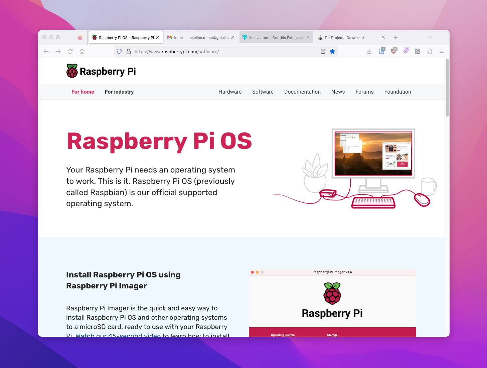

# Raspberry Pi Prerequisites 

## Hardware

- **Hardware:** [Raspberry Pi 4](https://www.amazon.com/Raspberry-Model-2019-Quad-Bluetooth/dp/B07TC2BK1X/?&_encoding=UTF8&tag=scidsg-20&linkCode=ur2&linkId=ee402e41cd98b8767ed54b1531ed1666&camp=1789&creative=9325)/[3B+](https://www.amazon.com/ELEMENT-Element14-Raspberry-Pi-Motherboard/dp/B07P4LSDYV/?&_encoding=UTF8&tag=scidsg-20&linkCode=ur2&linkId=d76c1db453c42244fe465c9c56601303&camp=1789&creative=9325)
- **Power:** [Raspberry Pi USB-C Power Supply](https://www.amazon.com/Raspberry-Pi-USB-C-Power-Supply/dp/B07W8XHMJZ?crid=20ZD3IB2N877C&keywords=raspberry%2Bpi%2Bpower%2Bsupply&qid=1696270477&sprefix=raspberry%2Bpi%2Bpower%2B%2Caps%2C140&sr=8-5&th=1&linkCode=ll1&tag=scidsg-20&linkId=fa55eb4c089361952be8285bf67bfd22&language=en_US&ref_=as_li_ss_tl)
- **Storage:** [Micro SD Card](https://www.amazon.com/Sandisk-Ultra-Micro-UHS-I-Adapter/dp/B073K14CVB?crid=1XCUWSKV8V2L1&keywords=microSD+card&qid=1696270565&sprefix=microsd+car%2Caps%2C137&sr=8-21&linkCode=ll1&tag=scidsg-20&linkId=a2865a28ae852876a5a6d27512e9d7ef&language=en_US&ref_=as_li_ss_tl)
- **SD Card Adapter:** [SD Card Reader](https://www.amazon.com/SanDisk-MobileMate-microSD-Card-Reader/dp/B07G5JV2B5?crid=3ESM9TOJBH8J7&keywords=microsd+card+adaptor+usb+sandisk&qid=1696270641&sprefix=microsd+card+adaptor+usb+sandisk%2Caps%2C135&sr=8-3&linkCode=ll1&tag=scidsg-20&linkId=90d3bed4e490d29d84bcf86d9fe75290&language=en_US&ref_=as_li_ss_tl) 
- _Affiliate links_

## Prepping Your Pi

If you didn't know, your Raspberry Pi doesn't come with an operating system. Don't panic! We're going to install one now called Raspberry Pi OS.

### 1. Raspberry Pi Imager

Like a Macbook runs MacOS, and a Dell runs Windows, a Raspberry Pi runs Linux, which comes in many different flavors depending on your needs. Since we're using a Raspberry Pi, we'll use Raspberry Pi OS (64-bit), an operating system made just for the Pi. The Imager installs the operating system onto your microSD card, where we'll set up Hush Line. Download it from https://www.raspberrypi.com/software/.

## Prep Your Card

### 2. Install Raspberry Pi OS
Open the Raspberry Pi Imager and click `Choose OS > Raspberry Pi OS (other) > Raspberry Pi OS (64-Bit)`.

Insert your microSD card into your computer, and then click `Choose Storage` and select your card.

Before clicking Write, click on the Settings gear in the bottom right of the window. Configure the following settings:

- Hostname = `pirelay`
- Enable SSH with password authentication
- User = `operator`
- Set a strong password
- Add wifi settings

## Boot up and log in to Your Pi

### 3. Insert microSD Card

Take your SD card and insert it into your Raspberry Pi. You'll find the SD card slide on the bottom of the board, opposite the ethernet ports.

Plug the power supply into the device and let it boot up.

### 4. Log In

On a Mac, open Spotlight search by pressing CMD + Space. Enter "Terminal" and select the application with the same name. 

Enter `ssh operator@pirelay.local`, and when prompted, enter the password you created in the second step.

### 5. Update your system

The last thing we need to do is to update our system. First, we'll give ourselves admin priviledges, then perform the update:

Enter `sudo su`, then `apt update && apt -y dist-upgrade && apt -y autoremove`.

🎉 That's it, you're ready to get started with Raspberry Pi!